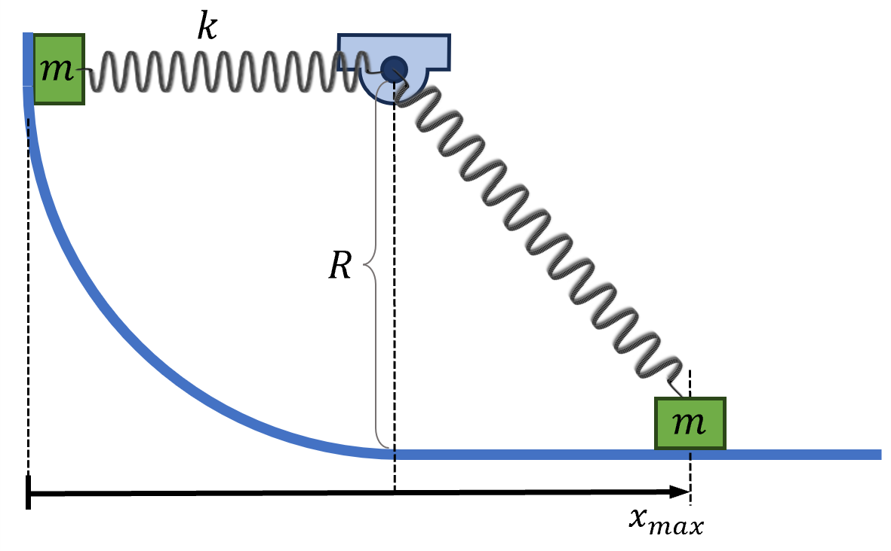

# Block attached to Spring
A block of mass $m$ attached to a linear spring with spring constant $k$ and an un-stretched length of $3R/2 m$ is held at equilibrium in the position shown below and then released from rest.

## Part 1

If the spring stiffness constant is increased, does the maximum horizontal displacement of the block increase or decrease?

### Answer Section

- {{ params.part1.ans1.value }}
- {{ params.part1.ans2.value }}
- {{ params.part1.ans3.value }}

## Attribution

Problem is from the [OpenStax University Physics Volume 2](https://openstax.org/details/books/university-physics-volume-2) textbook, licensed under the [CC-BY 4.0 license](https://creativecommons.org/licenses/by/4.0/). 