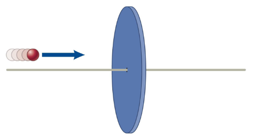

# {{ params.vars.title }}
A {{ params.m_d }} $kg$ disk initially at rest in the Earth reference frame is free to move parallel to a horizontal bar through a hole in the disk's centre. The disk is struck face-on by a {{ params.m_b }} $kg$ paintball traveling at {{ params.v }} $m/s$.

## Part 1

According to an observer in the Earth reference frame, what is the change in the system's kinetic energy after the ball hits the disk? Take the system to be the paintball and the disk and assume that after the collision all of the paint from the paintball sticks to the disk.

### Answer Section

Please enter in a numeric value in {{ params.vars.unit1 }}.

## Part 2

Before the paintball hits the disk, what is the velocity of the system's zero-momentum reference frame relative to the Earth reference frame?

### Answer Section

Please enter in a numeric value in {{ params.vars.unit2 }}.

## Part 3

What would an observer in the zero-momentum reference frame measure for the system's change in kinetic energy?

### Answer Section

Please enter in a numeric value in {{ params.vars.unit1 }}.

## Attribution

Problem is licensed under the [CC-BY-NC-SA 4.0 license](https://creativecommons.org/licenses/by-nc-sa/4.0/).  