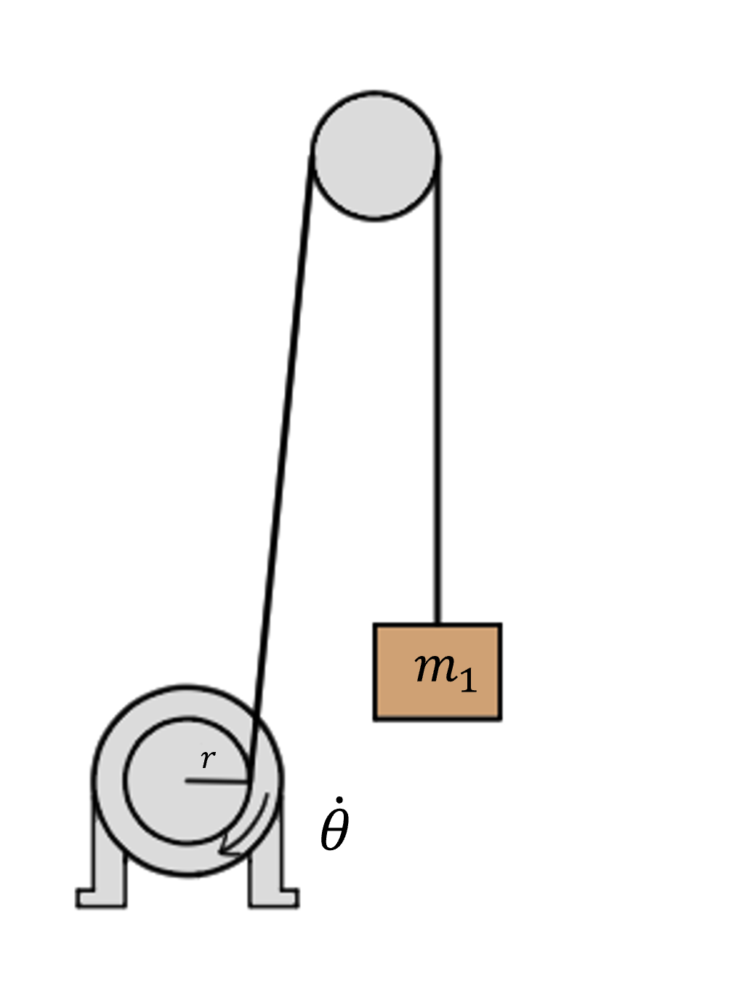

# {{ params_vars_title }}
A motor with an efficiency of ${{params_e}}$ is rotating a ${{params_r}} \ \rm{m}$ radius wheel at $\dot \theta = {{params_RPM}} \ \rm{RPM}$ to lift a ${{params_m1}} \ \rm{kg}$ mass.

## Part 1

How much power does the motor consume?

### Answer Section

Please enter in a numeric value in W.

## Part 2

After adding an ${{params_m2}} \ \rm{kg}$ load, you notice the wheel spins slower.
The power consumption does not change.
What is the new RPM?

### Answer Section

Please enter in a numeric value in RPM.

## Attribution

Problem is licensed under the [CC-BY-NC-SA 4.0 license](https://creativecommons.org/licenses/by-nc-sa/4.0/).  