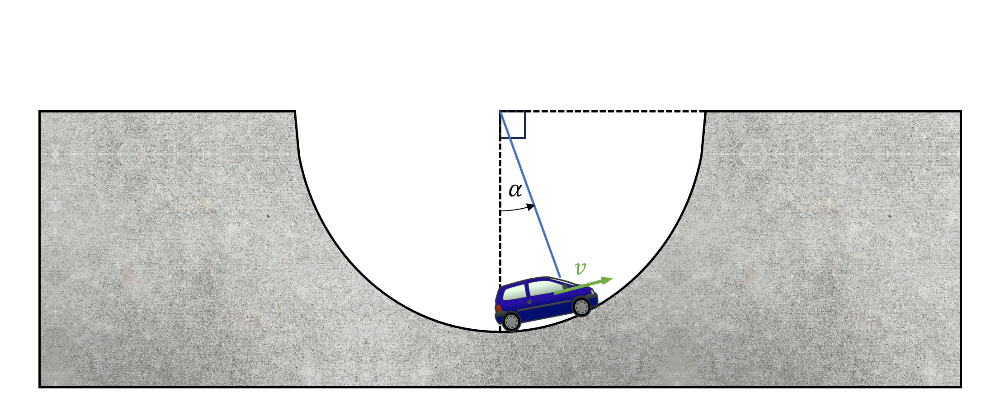

# {{ params_vars_title }}
A car is travelling up a smooth semi-circular slope with a constant speed of ${{ params_v }}\ \rm{kmh^{-1}}$.

## Question Text

What is the additional power which has to be developed in the engine to keep the car moving at this speed at $\alpha = {{ params_a }}^{\circ}$ mark?
 
Neglect air resistance. Treat the car as a particle with mass $M= {{ params_m }}\ \rm{kg}$

### Answer Section

Please enter in a numeric value in W.

## Part 2

At what point along the circular arc is the power developed by the engine the maximum if the speed is kept constant?

### Answer Section

- {{ params_part2_ans1_value}}
- {{ params_part2_ans2_value}}
- {{ params_part2_ans3_value}}

## Attribution

Problem is licensed under the [CC-BY-NC-SA 4.0 license](https://creativecommons.org/licenses/by-nc-sa/4.0/).  