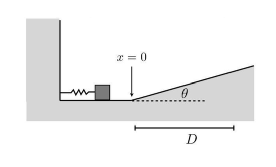

# {{ params.vars.title }}
A small {{params.m}} kg block is accelerated from rest on a flat surface by a compressed spring ($k$ = {{params.k}} $N/m$) along a frictionless, horizontal surface.
The block leaves the spring at the spring's equilibrium position ($x$ = 0) and travels on an incline ($\theta$ = {{params.theta}}$^{\circ}$) with a coefficient of kinetic friction $\mu_k$ = {{params.mu}}.
The block moves a horizontal distance $D$ = {{params.d}} m before coming to a stop.

## Part 1

(a) What is the initial compression of the spring?

### Answer Section

Please enter in a numeric value in {{ params.vars.units1 }}.

## Part 2

(b) What is the maximum kinetic energy of the block?

### Answer Section

Please enter in a numeric value in {{ params.vars.units2 }}.

## Attribution

Problem is licensed under the [CC-BY-NC-SA 4.0 license](https://creativecommons.org/licenses/by-nc-sa/4.0/).  