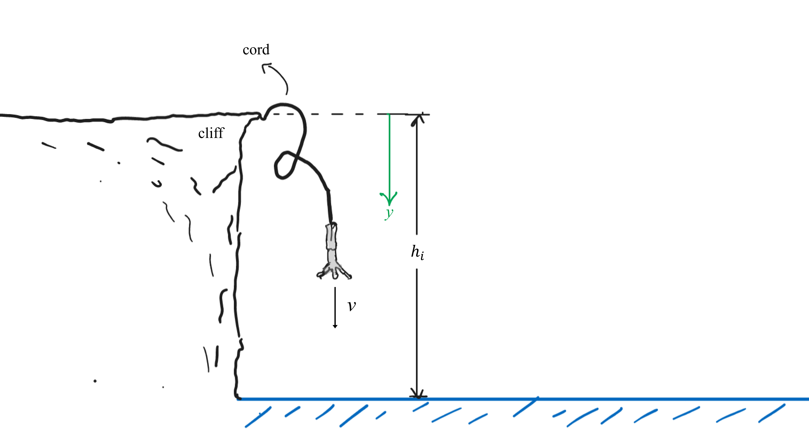

# Bungee Jumper
A bungee jumper comprises of a person attached to a rubber cord who then releases himself off a cliff at a high altitude above sea level as shown in the image below.

## Part 1

Treating the rubber cord as the equivalent of a linear spring with original un-stretched length $L = {{ params_l }} \ \rm{m}$ and spring stiffness constant $k = {{ params_k }}\ \rm{N/m}$, and neglecting any forces in the cord whilst it is slackened, determine the maximum vertical displacement from the cliff. 
Treat the person as a particle with mass $m$, and neglect the mass of the cord and any resistive forces. 
$m = {{ params_m }} \ \rm{kg}$, $h_1= {{ params_h1 }}\ \rm{m}$

### Answer Section

Please enter in a numeric value in $m$.

## Part 2

If the maximum possible upward acceleration that can safely be applied to a person is $2g$, what is the maximum value of the spring stiffness constant for this rope of initial length $L$?

### Answer Section

Please enter in a numeric value in $N/m$.

## Attribution

Problem is licensed under the [CC-BY-NC-SA 4.0 license](https://creativecommons.org/licenses/by-nc-sa/4.0/).  