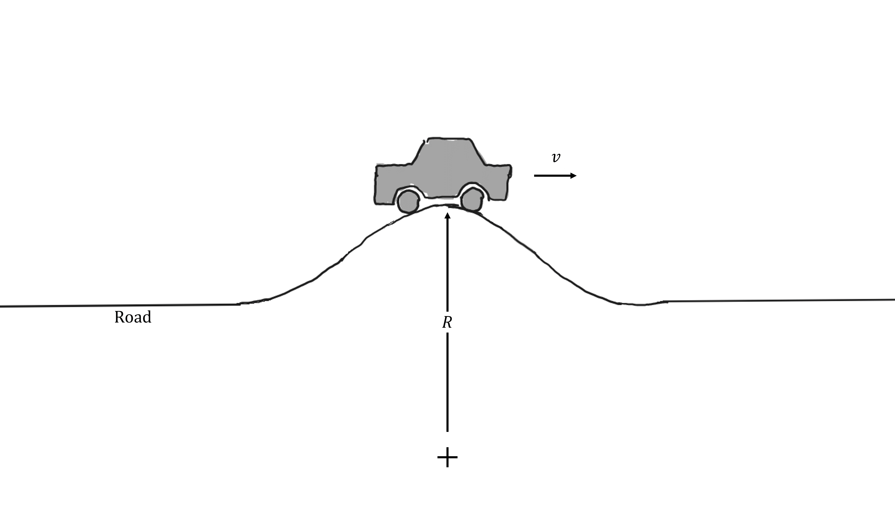
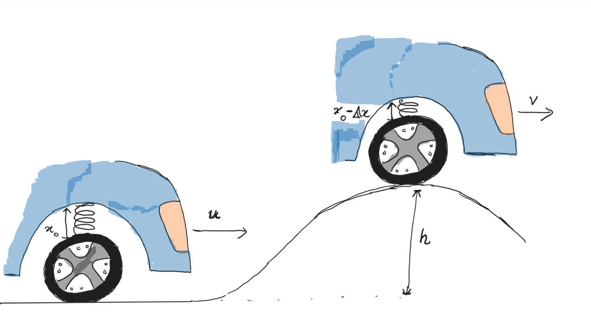

# {{ params_vars_title }}
A car is moving over a hump in the road with a constant speed $v \  \rm{ms^{-1}}$.

## Part 1

What is the maximum speed, $v$ with which the car can move without it losing contact with the road at the top of the hump.
 Treat the car as a particle. Neglect friction and air resistance.
 
$m = {{ params_m }} \ \rm{kg}$, $R = {{ params_r }} \ \rm{m}$

### Answer Section

Please enter value of $v$ in $m/s$.

## Part 2

In order to reduce the likelihood of loss of contact when navigating the curvature of the hump, a suspension system consisting of a series of springs is connected to the wheels to absorb some of the excess kinetic energy of the vehicle before it encounters the circular arc.
 If the maximum compression ($\delta x$) of the springs are ${{ params_x }}\ \rm{mm}$ at the top of the hump, what must the equivalent spring stiffness constant, $k$, be if the speed of the car goes at the top of the hump is ${{ params_v }} \ \rm{km/h}$.
 
The speed of the car just before the hump is ${{ params_u }} \ \rm{km/h}$. The height of the hump above the ground plane is $0.5 \ \rm{m}$.

### Answer Section

Please enter the value of $k$ in $Nm^{-1}$.

## Attribution

Problem is licensed under the [CC-BY-NC-SA 4.0 license](https://creativecommons.org/licenses/by-nc-sa/4.0/).  