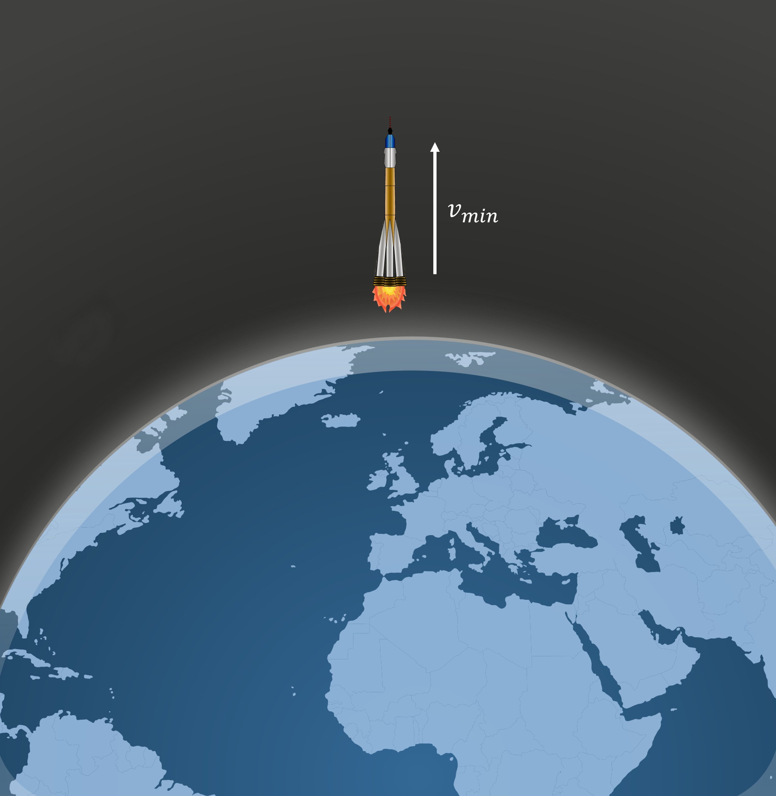

# Escape Velocity
A rocket is fired from the surface of the Earth with speed $v\ \rm{ms^{-1}}$.

## Part 1

What is the minimum speed **$v$** with which a rocket, which has a mass of ${{ params_m }}\ \rm{tonnes}$ would need to be fired from the surface of the earth to escape the earth's gravitational field (i.e gravitational force goes to zero). 
 Treat the rocket as a single particle and neglect air resistance. Assume the mass of the rocket remains constant throughout its motion. Neglect local gravitational effects in the vicinity of the launch point.
 
The diameter of the earth is $d = 12742km$, the mass of the earth is $M\_{earth} = 5.976\times 10^{24}\ \rm{kg}$

### Answer Section

Please enter in a numeric value in m/s.

## Attribution

Problem is licensed under the [CC-BY-NC-SA 4.0 license](https://creativecommons.org/licenses/by-nc-sa/4.0/).  