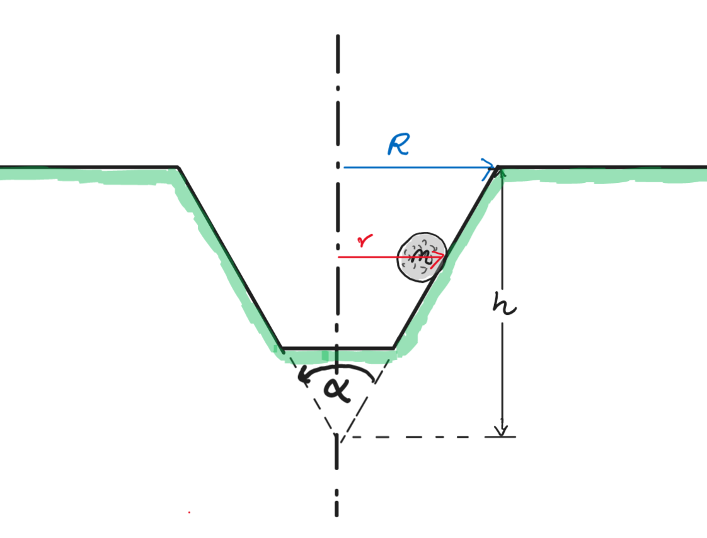

# Golf Ball in Hole
A golf ball lands with a speed of $u = {{ params_u }}\ \rm{ms^{-1}}$ in a tapered frictionless hole as shown below.

## Part 1

Does the golf ball remain in stable orbit at the circle of radius $r$, if the ball begins to rotate about the vertical axis of the hole at point A? 
$r = {{ params_r }}\ \rm{m}$, $\alpha = {{ params_a }}^{\circ}$

### Answer Section

- {{ params_part1_ans1_value}}
- {{ params_part1_ans2_value}}

## Part 2

Determine the maximum speed of the ball for it to remain in stable orbit about the circle of radius $r$.

### Answer Section

Please enter a value in $m/s$.

## Part 3

Using principles of conservation of energy, does the ball spin out of the hole? 
$H\_{hole} = {{ params_h }}\ \rm{m}$, $R\_{hole}= {{ params_r_h }}\ \rm{m}$.

### Answer Section

- {{ params_part3_ans1_value}}
- {{ params_part3_ans2_value}}

## Part 4

Determine the radius of the stable orbit gained by the golf ball(i.e stable implies that the centripetal force is sufficiently provided by the forces acting on the ball and the ball rotates in a circle of constant height).

### Answer Section

Please enter a value in $m$.

## Part 5

What is the speed of the golf ball in this stable orbit?

### Answer Section

Please enter a value in $m/s$.

## Attribution

Problem is licensed under the [CC-BY-NC-SA 4.0 license](https://creativecommons.org/licenses/by-nc-sa/4.0/).  