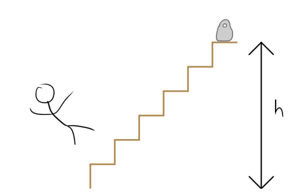

# {{ params_vars_title }}
A ${{params_m1}} \ \rm{kg}$ delivery driver is carrying ${{params_m2}} \ \rm{kg}$ groceries up a ${{params_h}} \ \rm{m}$ flight of stairs.

## Part 1

How much work did he do?
Neglect any horizontal forces or motion.

### Answer Section

Please enter in a numeric value in J.

## Part 2

At the top of the stairs, the man slips, drops his groceries and falls directly to the bottom floor.
Upon impact, the man decelerates to $0 \ \rm{m/s}$ in ${{params_t}} \ \rm{ms}$.
With what average force does the man hit the ground?

### Answer Section

Please enter in a numeric value in N.

## Attribution

Problem is licensed under the [CC-BY-NC-SA 4.0 license](https://creativecommons.org/licenses/by-nc-sa/4.0/).  