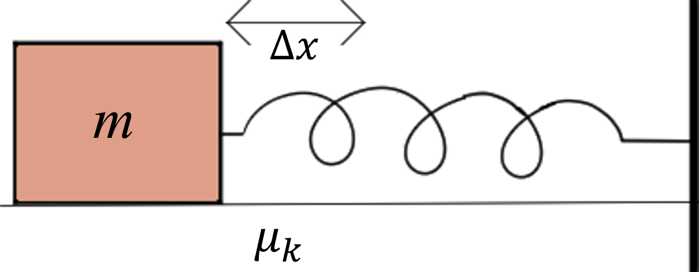

# {{ params_vars_title }}
A ${{params_m}} \ \rm{kg}$ mass is attached to a wall by a spring of spring constant ${{params_k}} \ \rm{N/m}$.
A woman pulls the mass until the spring is stretched ${{params_deltaX}} \ \rm{m}$ from its rest position.
She releases the mass and it springs towards the wall.

## Part 1

Given that the kinetic coefficient of friction is ${{params_nu}}$, how far will the spring compress from its rest state?

### Answer Section

Please enter in a numeric value in m.

## Part 2

How much energy is lost to friction?

### Answer Section

Please enter in a numeric value in J.

## Attribution

Problem is licensed under the [CC-BY-NC-SA 4.0 license](https://creativecommons.org/licenses/by-nc-sa/4.0/).  