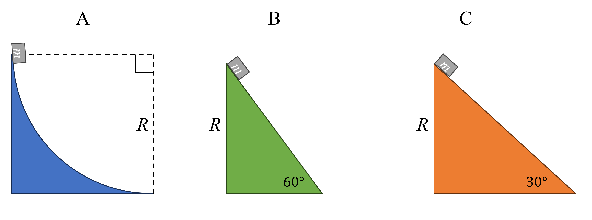

# Work by Friction
In which of the following paths is the greatest work done by friction down the slope. Assume a constant and equal force of friction acts on the object along the slope.

## Part 1

### Answer Section

- {{ params.part1.ans1.value }}
- {{ params.part1.ans2.value }}
- {{ params.part1.ans3.value }}

## Attribution

Problem is licensed under the [CC-BY-NC-SA 4.0 license](https://creativecommons.org/licenses/by-nc-sa/4.0/).  