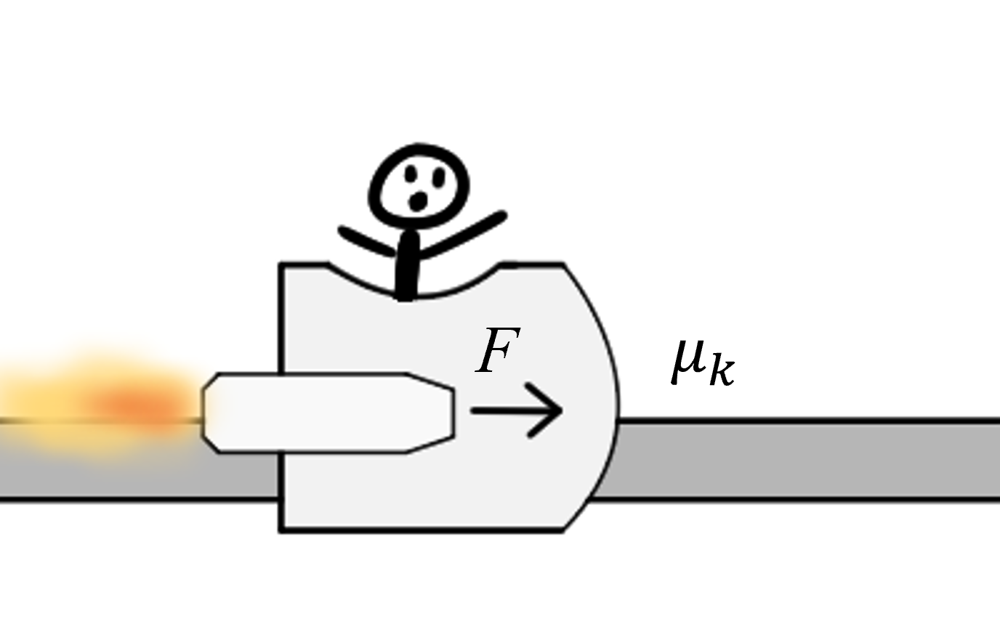

# {{ params_vars_title }}
A ${{params_m}} \ \rm{kg}$ cart uses rocket propulsion to accelerate on a track.
The rockets are known to deliver ${{params_F}} \ \rm{kN}$ of thrust total.
The kinetic friction coefficient is ${{params_nu}}$.
The cart begins at rest, and the rockets are on for ${{params_t}} \ \rm{s}$.

## Part 1

What is the maximum speed of the cart?

### Answer Section

Please enter in a numeric value in m/s.

## Part 2

How much work was done by the rockets?

### Answer Section

Please enter in a numeric value in kJ.

## Part 3

If the rockets are angled upward to cancel friction, what is the new maximum speed of the cart?

### Answer Section

Please enter in a numeric value in m/s.

## Part 4

How much work was done by the rockets this time?

### Answer Section

Please enter in a numeric value in kJ.

## Attribution

Problem is licensed under the [CC-BY-NC-SA 4.0 license](https://creativecommons.org/licenses/by-nc-sa/4.0/).  