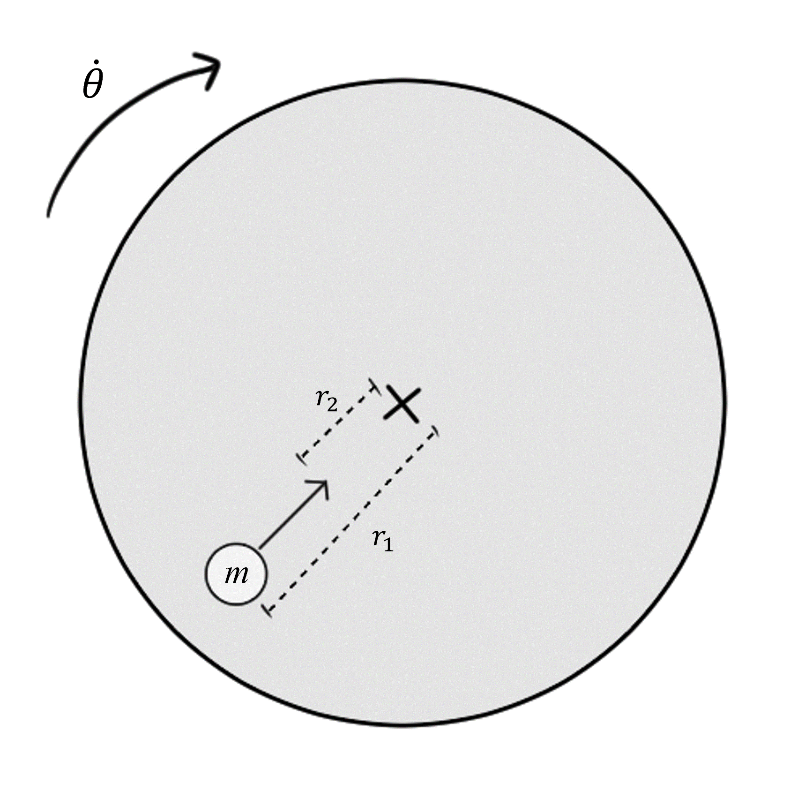

# {{ params_vars_title }}
A ${{params_m}}\ \rm{kg}$ man is walking at a constant speed towards the center of a platform spinning at a constant rate of ${{params.theta_dot}} \ \rm{rad/s}$.

## Part 1

If his initial distance from the center is $r_1={{params_r1}} \ \rm{m}$, and he moves to a new location where $r={{params_r2}}\ \rm{m}$, how much work did he do?

### Answer Section

Please enter in a numeric value in J.

## Attribution

Problem is licensed under the [CC-BY-NC-SA 4.0 license](https://creativecommons.org/licenses/by-nc-sa/4.0/).  