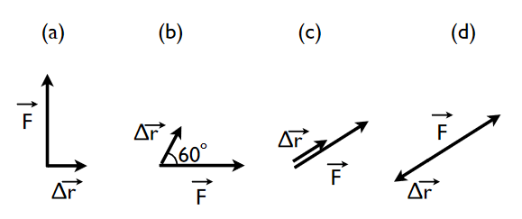

# {{ params.vars.title }}
Calculate the work done by a constant force of magnitude $F = $ {{ params.F }} $N$ applied over a displacement of magnitude $\Delta r = $ {{ params.r }} $m$ for all four of the diagrams.

<h5>Long Description of image: Image of the force acting at different angles to the displacement.</h5>
Figure a shows the force acting perpendicular to the displacement. 
Figure b shows the force acting at an angle of sixty degrees to the displacement. The force F is horizontal and acts to the right. 
Figure c shows the force acting parallel to the displacement and in the same direction. 
Figure d shows the force acting parallel to the displacement but in the opposite direction. 

Long description ends.

## Part 1

Calculate the work done for Figure (a).

### Answer Section

Please enter in a numeric value in {{ params.vars.units }}.

## Part 2

Calculate the work done for Figure (b).

### Answer Section

Please enter in a numeric value in {{ params.vars.units }}.

## Part 3

Calculate the work done for Figure (c).

### Answer Section

Please enter in a numeric value in {{ params.vars.units }}.

## Part 4

Calculate the work done for Figure (d).

### Answer Section

Please enter in a numeric value in {{ params.vars.units }}.

## Attribution

Problem is licensed under the [CC-BY-NC-SA 4.0 license](https://creativecommons.org/licenses/by-nc-sa/4.0/).  