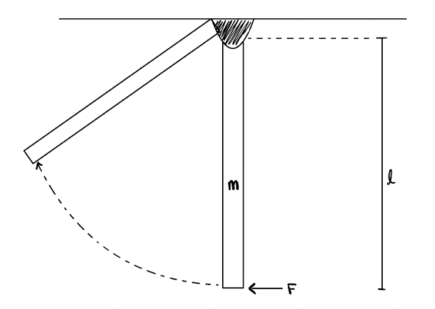

# {{ params_vars_title }}

A rod with a mass of $m = {{ params_m }} \ \rm{kg}$ and length $l = {{ params_L }} \ \rm{m}$ hangs at rest when the force $F = {{ params_F }} \ \rm{N}$ is applied.

## Part 1

Find the angular velocity of the rod when it has rotated $90^{\circ}$ clockwise.

### Answer Section

Please enter in a numeric value in {{ params_vars_units }}.

## Attribution

Problem is licensed under the [CC-BY-NC-SA 4.0 license](https://creativecommons.org/licenses/by-nc-sa/4.0/).  