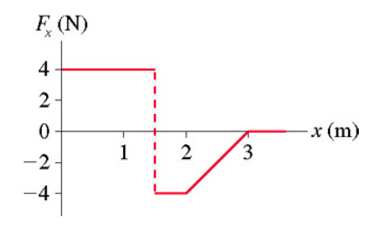

# {{ params.vars.title }}
The graph below shows the net force on a particle as a function of its position. The mass of
the particle is $m =$ {{params.m}} $kg$.

## Part 1

What is the total work done on the particle?

### Answer Section

Please enter in a numeric value in {{ params.vars.units1 }}.

## Part 2

If the particle has a velocity of $v_x =$ {{params.v}} $m/s$ when $x =$ 0 $m$, what is the particle's velocity
when $x =$ {{params.x}} $m$?

### Answer Section

Please enter in a numeric value in {{ params.vars.units2 }}.

## Part 3

At what value of x (in meters) does the particle have the maximum kinetic energy?

### Answer Section

Please enter in a numeric value in {{ params.vars.units3 }}.

## Part 4

What is the particle's maximum kinetic energy?

### Answer Section

Please enter in a numeric value in {{ params.vars.units1 }}.

## Attribution

Problem is licensed under the [CC-BY-NC-SA 4.0 license](https://creativecommons.org/licenses/by-nc-sa/4.0/).  