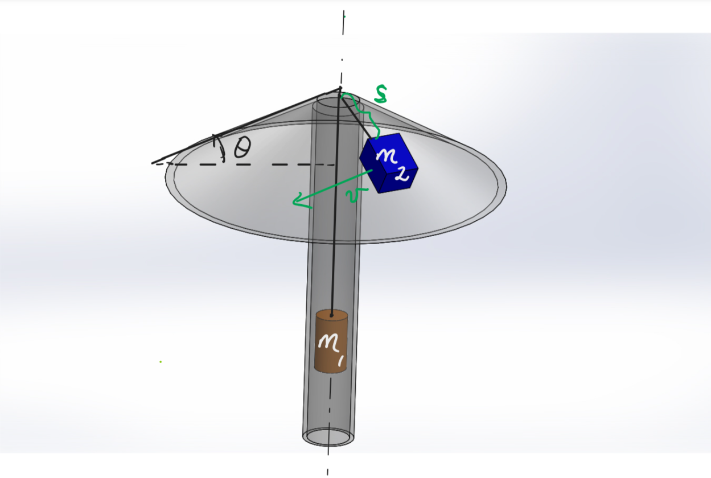
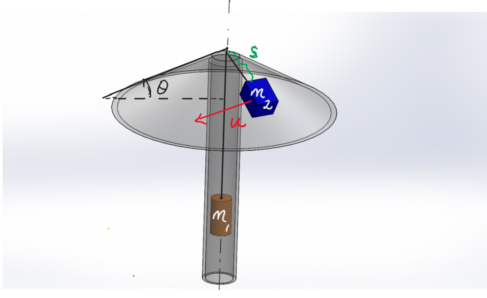

# Circular Motion on a Lamp Surface
An object of mass $m_2 = {{ params.m_2 }}\ \rm{kg}$ is attached to a freely hanging load of mass $m_1 = {{ params.m_1 }}\ \rm{kg}$ suspended vertically through a light inextensible rope of length $L = {{ params.l }}\ \rm{m}$. The object is also lying on a frictionless inverted funnel surface akin to the top surface of a lamp as illustrated below.

## Part 1

If the object is accelerated from rest to a speed $v$ in the direction shown, determine the speed $v\_{stable}$ of stable orbit of the rotating object about the vertical axis of the funnel in the position shown above. 
Treat the object and load as particles and neglect the radius of the pulley and air resistance. 
$\theta = {{ params.theta }}^{\circ}$, $s = {{ params.s }}\ \rm{m}$

### Answer Section

Please enter in a numeric value in $m/s$.

## Part 2

What is the **minimum** mass of the hanging load($m_1$) for the rotating object($m_2$) to **attain a stable orbit** and **remain in contact** with the surface? 
Express your answer as a multiple of mass $m_2$.

### Answer Section

Please enter in a numeric value.

## Part 3

What is the **maximum** mass of the hanging load($m_1$) for the rotating object($m_2$) to **attain a stable orbit** and **remain in contact** with the surface? 
Express your answer as a multiple of mass $m_2$.

### Answer Section

Please enter in a numeric value.

## Part 4

Using conservation of angular momentum determine the final radius of stable orbit gained by mass $m_2$ when it is projected with a speed of $u = {{ params.u }}\ \rm{m/s}$ at a distance of $s = {{ params.s }}\ \rm{m}$ from the pulley.

<i>Does your answer confirm the inference in part 4?</i>

### Answer Section

Please enter in a numeric value in $m$.

## Part 5

What is the new speed of the final stable orbit gained by mass $m_2$?

### Answer Section

Please enter in a numeric value in $m/s$.

## Part 6

It seems attaining a stable orbit requires external work to be done on the system since the speed of mass $m_2$ has changed from its initial speed, therefore total mechanical energy(K.E and G.P.E) has **NOT** been conserved. 
Is this true or false?

### Answer Section

- {{ params.part7.ans1.value }}
- {{ params.part7.ans2.value }}

## Attribution

Problem is licensed under the [CC-BY-NC-SA 4.0 license](https://creativecommons.org/licenses/by-nc-sa/4.0/).  