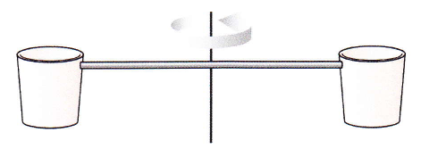

# {{ params_vars_title }}
A pair of buckets are connected by a *massless* rod. As shown in the figure, the buckets rotate about an axis through the centre of mass of the two-bucket system.

## Part 1

If each bucket has a mass $m$ and the rod has length $l$, what is the rotational inertia of the system? Give your answer in terms of $m$ and $l$. Treat the buckets as point masses and recall that $I = \sum\limits_i m_ir_i^2$.

Note that it may not be necessary to use every variable. Use the following table as a reference for each variable:

| For  | Use   |
|----------|-------|
| $m$  | m  |
| $l$  | l  |

### Answer Section

## Part 2

Assume that initially the buckets rotate with angular speed $\omega_0$. Then it rains for a short time.
After the rain has stopped, the buckets are observed to be rotating with angular speed $\omega_f = \omega/${{ params_c}}.
How much rain (in kg) has been collected by the two buckets? When empty, the buckets each have a mass of {{ params_m1 }} kg.

### Answer Section

Please enter in a numeric value in {{ params_vars_units }}.

## Attribution

Problem is licensed under the [CC-BY-NC-SA 4.0 license](https://creativecommons.org/licenses/by-nc-sa/4.0/).  