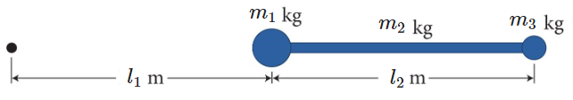

# {{ params.vars.title }}

## Question Text

Determine the position of the centre of mass of the baton shown in the figure below.
The ball at the left end has a mass of $m_1 = $ {{ params.m1 }} $kg$, the ball at the right end has a mass of $m_3 = $ {{ params.m3 }} $kg$, and the bar has a mass of $m_2 = $ {{ params.m2 }} $kg$.
Take the point $l_1 = $ {{ params.l1 }} $m$ to the left of the {{ params.m1 }} $kg$ mass as your origin.
The length from the center of the left ball to the center of the right ball is $l_2 = $ {{ params.l2 }} $m$.

### Answer Section

Please enter in a numeric value in {{ params.vars.units }}.

## Attribution

Problem is licensed under the [CC-BY-NC-SA 4.0 license](https://creativecommons.org/licenses/by-nc-sa/4.0/).  