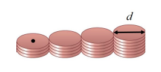

# {{ params_vars_title }}
There are four stacks of pennies lined up in a row. The first stack has {{params.s_1}} pennies, the
second stack {{params.s_2}} pennies, the third stack {{params.s_3}} pennies, and the last stack {{params.s_4}} pennies.
All pennies have mass $m$ and diameter $d$.

## Question Text

How far to the right of the centre of the first stack is the centre of mass of this collection of pennies? Give your answer in terms of $d$.
Don't worry about the vertical position of the centre of mass, just give the horizontal position.

### Answer Section

Please enter in a numeric value in terms of $d$ (if your answer is 50$d$, then just enter 50 in the box).

## Attribution

Problem is licensed under the [CC-BY-NC-SA 4.0 license](https://creativecommons.org/licenses/by-nc-sa/4.0/).  