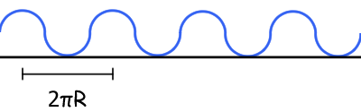

# {{ params.vars.title }}
A wheel is rolling along a surface at speed $v$ without slipping.

## Part 1

Which of the following options best traces the path of point $A$?

Graph 1:

Graph 2:

Graph 3:

Graph 4:

### Answer Section

- {{ params.part1.ans1.value }}
- {{ params.part1.ans2.value }}
- {{ params.part1.ans3.value }}
- {{ params.part1.ans4.value }}
- {{ params.part1.ans5.value }}

## Attribution

Problem is licensed under the [CC-BY-NC-SA 4.0 license](https://creativecommons.org/licenses/by-nc-sa/4.0/).  