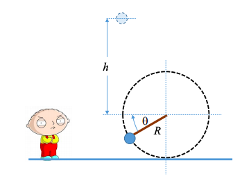

# {{ params.vars.title }}
Stewie watches as a rock tied to a string is swung clockwise in a vertical circle of radius $r$. The
string breaks when $\theta$ = 0. Stewie observes that the rock reaches a maximum height $h$ relative to the height of the centre of the circle. What is the angular speed $\omega$ of the circular motion at the instant just before the string breaks?

| $Variable$ | Use   |
|----------|-------|
| $g$  | g  |
| $h$  | h  |
| $r$  | r  |

## Part 1

Find an expression for $\omega$ in terms of $h$, $r$, and the gravitational acceleration $g$.

### Answer Section

## Attribution

Problem is licensed under the [CC-BY-NC-SA 4.0 license](https://creativecommons.org/licenses/by-nc-sa/4.0/).  