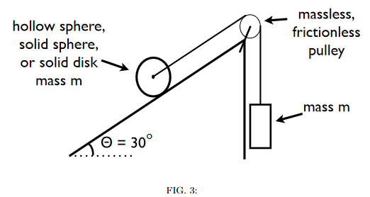

# {{ params.vars.title }}
One end of a massless string is attached to a massless axle that passes through the centre of mass of an object (mass $m$) that has a circular cross-section (radius $R$)  and  rolls  without  slipping  up  the  incline.
The  string  passes  over a massless, frictionless pulley and a block (also of mass $m$) is suspended from the opposite end of the string as shown in the figure.In this problem you are to find the speed of the rolling object after the hanging mass has fallen by {{ params.h }} $m$ (the system is released from rest).

<h5>Long Description of image: Figure of the system described in the question text.</h5>
An object with a circular cross-section rolls up a thirty-degree incline (to the horizontal).  This object is attached to a string which passes  over a massless, frictionless pulley and a block of mass m is suspended from the opposite end of the string. The whole setup forms a right-angle triangle with the opposite side on the right.

Long description ends.

## Part 1

Find the rolling object's speed assuming that it is a solid sphere.

### Answer Section

Please enter in a numeric value in {{ params.vars.units }}.

## Part 2

Find the rolling object's speed assuming that it is a hollow sphere.

### Answer Section

Please enter in a numeric value in {{ params.vars.units }}.

## Part 3

Find the rolling object's speed assuming that it is a solid cylinder.

### Answer Section

Please enter in a numeric value in {{ params.vars.units }}.

## Attribution

Problem is licensed under the [CC-BY-NC-SA 4.0 license](https://creativecommons.org/licenses/by-nc-sa/4.0/).  