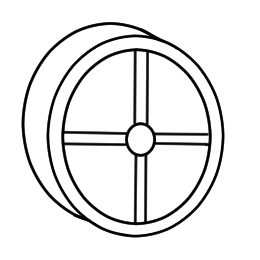

# {{ params_vars_title }}
A flywheel is a wheel with a high moment of inertia that spins to store kinetic energy.
It has applications in cars, gyroscopes, and electrical power systems.

A flywheel of mass ${{params_m}}\ \rm{kg}$, and radius of gyration ${{params_R}}\ \rm{cm}$ is spinning at ${{params_RPM}}\ \rm{RPM}$.

## Part 1

How much kinetic energy is stored in the wheel?

### Answer Section

Please enter in a numeric value in kJ.

## Part 2

If the coefficient of rolling friction of the bearing is ${{params_Crr}}$, for how long will the flywheel spin?
This friction occurs at an inner radius of ${{params_r}}\ \rm{cm}$.
Note that the rolling resistance force is analogous to the force of friction, where $F\_{friction} = {\mu}\_rF_N$.

### Answer Section

Please enter in a numeric value in hours.

## Attribution

Problem is licensed under the [CC-BY-NC-SA 4.0 license](https://creativecommons.org/licenses/by-nc-sa/4.0/).  