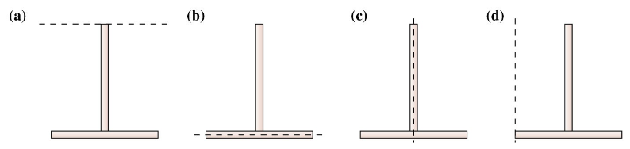

# {{ params.vars.title }}
Four 'T's are made from two identical rods of equal mass and length.  The Ts are rotated about various rotation axes indicated by the dashed lines in the figures.

## Part 1

For which of the cases below is the resulting rotational inertia a {{ params.choice }}?

 

<h5>Long Description of image: Four Ts with different rotation axes.</h5>
All four figures show an inverted T.  
In Figure a, the dashed line is horizontal, parallel to the base of the inverted T, and is found at the tip of the tail. 
In Figure b, the dashed line is horizontal and cuts through the base of the inverted T.  
In Figure c, the dashed line is vertical and cuts through the tail of the inverted T.  
In Figure d, the dashed line is vertical, parallel to the tail of the inverted T, and cuts through the left end of the base.

Long description ends.

### Answer Section

- {{ params.part1.ans1.value }}
- {{ params.part1.ans2.value }}
- {{ params.part1.ans3.value }}
- {{ params.part1.ans4.value }}

## Attribution

Problem is licensed under the [CC-BY-NC-SA 4.0 license](https://creativecommons.org/licenses/by-nc-sa/4.0/).  