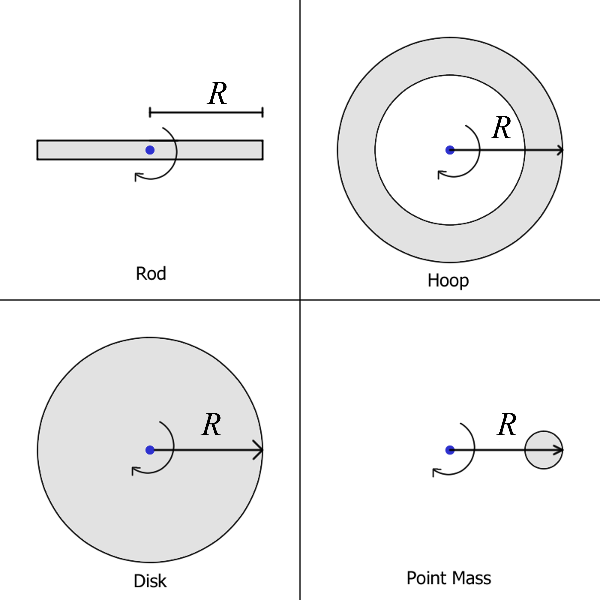

# {{ params_vars_title }}

## Question Text

Each of the mass distributions below are drawn to the same scale, and have equal mass.
The same moment is applied to each of them.
Which shape experiences the highest angular acceleration?

### Answer Section

- {{ params.part1.ans1}}
- {{ params.part1.ans2}}
- {{ params.part1.ans3}}
- {{ params.part1.ans4}}

## Attribution

Problem is licensed under the [CC-BY-NC-SA 4.0 license](https://creativecommons.org/licenses/by-nc-sa/4.0/).  