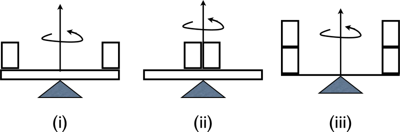

# {{ params.vars.title }}
A side view of three turntables is shown in the figure below. The curly arrow shows the direction of rotation. Turntable (i) is a disk of mass $10$ $\rm{kg}$ and supports a $5$ $\rm{kg}$ mass at each end as seen in the figure. Turntable (ii) is a disk of mass $10$ $\rm{kg}$ and supports two masses of $5$ $\rm{kg}$ each near its centre. Turntable (iii) is massless and supports $10$ $\rm{kg}$ of mass at each end.

## Part 1

Rank the moments of inertia:

### Answer Section

- {{ params.part1.ans1.value }}
- {{ params.part1.ans2.value }}
- {{ params.part1.ans3.value }}
- {{ params.part1.ans4.value }}
- {{ params.part1.ans5.value }}

## Attribution

Problem is licensed under the [CC-BY-NC-SA 4.0 license](https://creativecommons.org/licenses/by-nc-sa/4.0/).  