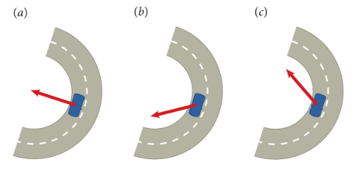

# {{ params_vars_title }}
As you drive *{{ params_vars_dir }}* around a turn (as viewed from above), you see backed-up traffic ahead and so you slow down.

## Part 1

In which of the figures below does the arrow best represent the acceleration of the {{ params_vars_vehicle }}?

 

<h5>Long Description of image: Figures of the same vehicle with the acceleration arrow pointing in different directions.</h5>
The acceleration arrow in A is pointing directly towards the centre of the track, in B the acceleration arrow points below the horizontal, and in C the acceleration arrow points above the horizontal.

Long description ends.

### Answer Section

- {{ params_part1_ans1_value }}
- {{ params_part1_ans2_value }}
- {{ params_part1_ans3_value }}
- {{ params_part1_ans4_value }}

## Attribution

Problem is licensed under the [CC-BY-NC-SA 4.0 license](https://creativecommons.org/licenses/by-nc-sa/4.0/).  