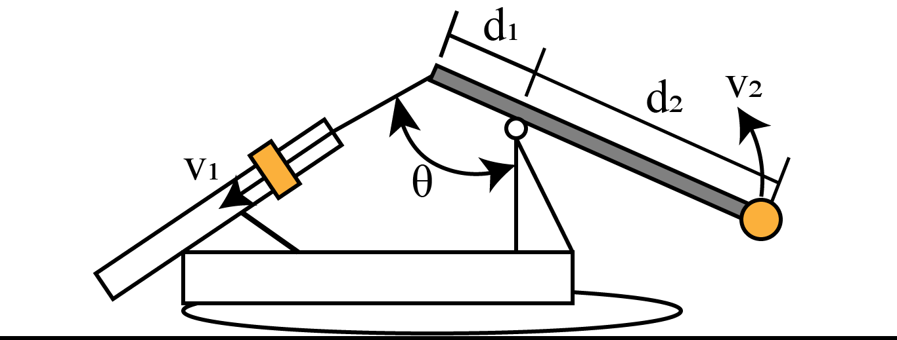

# {{ params.vars.title }}

A common problem when assembling a mining drill is attaching the mast tower.
A common method to attach the mast is to attach a chain to the feed cylinders and spin the mast up.
If the feed cylinder lowers at a rate of $v_1 = {{ params.v }} \ \rm{m/s}$, then what is the angular speed the tip of the tower is moving at in the instant shown?
The distance from the chain to the pivot tower is $d_1 = {{ params.d1 }} \ \rm{m}$, the distance from the pivot tower to the end of the mast is $d_2 = {{ params.d2 }} \ \rm{m}$, and the angle between the chain and pivot tower is $\theta = {{ params.theta }} ^{\circ}$

## Part 1

### Answer Section

Please enter in a numeric value in {{ params.vars.units }}.

## Attribution

Problem is licensed under the [CC-BY-NC-SA 4.0 license](https://creativecommons.org/licenses/by-nc-sa/4.0/).  