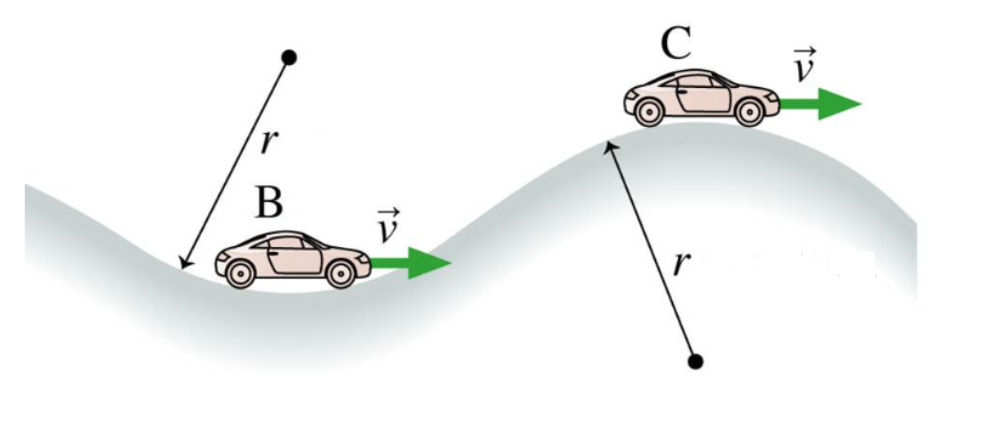

# {{ params.vars.title }}
Two cars are driving at {{params.v}} $m/s$ along the road shown in the figure.
Car B is at the bottom of a hill and car C is at the top. Both hills have a {{params.r}} $m$ radius of curvature.
Suppose both cars suddenly brake hard and start to skid.

## Part 1

What is the tangential (i.e., the acceleration parallel to the road) of car B?
Assume $\mu_k = 0.850$.

### Answer Section

Please enter in a numeric value in {{ params.vars.units}}.

## Part 2

What is the tangential (i.e., the acceleration parallel to the road) of car C?
Assume $\mu_k = 0.850$.

### Answer Section

Please enter in a numeric value in {{ params.vars.units}}.

## Attribution

Problem is licensed under the [CC-BY-NC-SA 4.0 license](https://creativecommons.org/licenses/by-nc-sa/4.0/).  