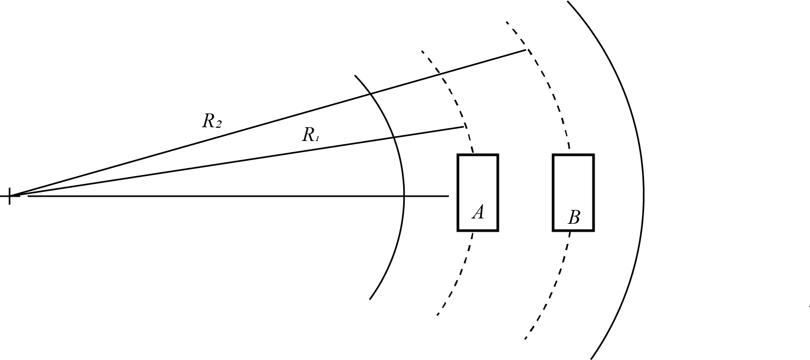

# {{ params.vars.title }}
Two cars travel side by side on an even, unbanked turn in a roadway.
Determine the maximum speed for each car if the normal acceleration is limited to g.
$R\_{1} = {{params.r1}}m$, $R\_{2} = {{params.r2}}m$

## Part 1

Determine the maximum speed for car A.

### Answer Section

Please enter in a numeric value in {{ params.vars.units }}.

## Part 2

Determine the maximum speed for car B.

### Answer Section

Please enter in a numeric value in {{ params.vars.units }}.

## Attribution

Problem is licensed under the [CC-BY-NC-SA 4.0 license](https://creativecommons.org/licenses/by-nc-sa/4.0/).  