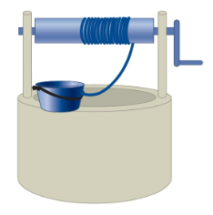

# {{ params_vars_title }}
A bucket of mass $m_b$ = {{ params.m_b }} $kg$ is knocked off the side of a well.
The bucket falls {{ params_h }} $m$ to the bottom of the well.
Attached to the bucket is a light rope that wraps around a cylinder of radius $r = $ {{ params_r}} $cm$ and mass $m_c$ = {{ params.m_c }} $kg$.

## Question Text

How fast is the bucket falling just before it hits the ground?

### Answer Section

Please enter in a numeric value in {{ params_vars_units }}.

## Attribution

Problem is licensed under the [CC-BY-NC-SA 4.0 license](https://creativecommons.org/licenses/by-nc-sa/4.0/).  