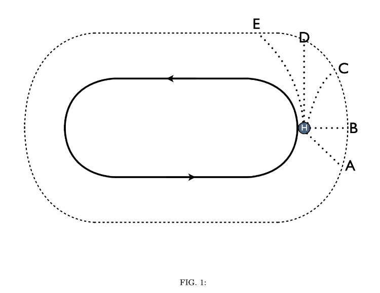

# {{ params_vars_title }}
In short-track speed skating skaters frequently fall.
At one of the winter Olympics, speed skater Charles Hamelin won a gold medal in the 1500 $m$, but fell during a turn of the 500 $m$ sprint.

<h5>Long Description of image: Possible directions the skater slides</h5>
Fig.1 depicts a oval shaped skating rink with arrows that indicate the skaters skate in a counter clockwise direction. Point 'H' is located near the right side of the rink just before a turn. Letters 'A' to 'E' indicate possible motions that the skater could slide after falling. 'A' depicts a motion that is in the opposite direction as the circular skating direction. 'B' depicts sliding out to the right and away from the circular motion of the skaters. 'C' depicts a curved motion away from the uniform circular skating motion. 'D' depicts a straight line motion in the same direction that the skater was going in. 'E' depicts a curved motion that follows the direction and curve of the circular skating rink.

Long description ends.

## Part 1

If Charles fell at the point marked H in Fig.1 while in uniform circular motion, at which labeled point would he have hit the safety retaining wall after a frictionless slide across the ice? (Arrows indicate the direction that skaters skate in.)

### Answer Section

- {{ params_part1_ans1_value }}
- {{ params_part1_ans2_value }}
- {{ params_part1_ans3_value }}
- {{ params_part1_ans4_value }}
- {{ params_part1_ans5_value }}

## Attribution

Problem is licensed under the [CC-BY-NC-SA 4.0 license](https://creativecommons.org/licenses/by-nc-sa/4.0/).  