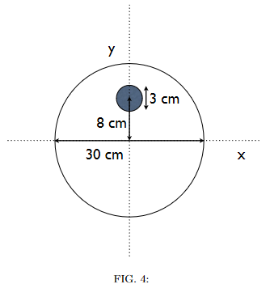

# {{ params.vars.title }}
A disk that will appear to roll uphill is made from spruce ($\rho\_{\text{spruce}} = $ {{ params.rho_spruce }} $kg/m^3$) and steel ($\rho\_{\text{steel}} = $ {{ params.rho_steel }} $kg/m^3$) by drilling a 3 $cm$ diameter hole, centred 8 $cm$ above the centre of a 30 $cm$ diameter spruce cylinder, as shown in the figure.  Into this hole is inserted a piece of steel of identical dimensions.  The disk has a {{ params.w_disk }} $cm$ width.

<h5>Long Description of image: Disk of spruce and steel.</h5>
The figure shows a disk centred at the origin of a cartesian plane with diameter 30 cm.
There is a hole of diameter 3cm centred 8 cm above the centre of the disk.

Long description ends.

## Part 1

Calculate the mass of the spruce removed from this disk.

### Answer Section

Please enter in a numeric value in {{ params.vars.units }}.

## Part 2

Calculate the mass of the steel that replaces the spruce.

### Answer Section

Please enter in a numeric value in {{ params.vars.units }}.

## Part 3

The location of the centre of mass of the weighted disk is closest to:

### Answer Section

- {{ params.part3.ans1.value}}
- {{ params.part3.ans2.value}}
- {{ params.part3.ans3.value}}
- {{ params.part3.ans4.value}}
- {{ params.part3.ans5.value}}
- {{ params.part3.ans6.value}}

## Attribution

Problem is licensed under the [CC-BY-NC-SA 4.0 license](https://creativecommons.org/licenses/by-nc-sa/4.0/).  