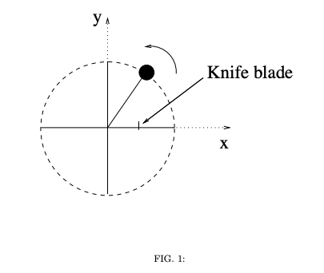

# {{ params.vars.title }}
A mass, $m$, tied to the end of a string is swung **horizontally** on a frictionless surface in the counter-clockwise direction, exhibiting uniform circular motion as shown in Fig. 1.

## Part 1

When the string returns to parallel to the $x$-axis, it is cut in half by a very sharp knife. The subsequent motion of the mass is:

### Answer Section

- {{ params.part1.ans1.value }}
- {{ params.part1.ans2.value }}
- {{ params.part1.ans3.value }}
- {{ params.part1.ans4.value }}
- {{ params.part1.ans5.value }}

## Attribution

Problem is licensed under the [CC-BY-NC-SA 4.0 license](https://creativecommons.org/licenses/by-nc-sa/4.0/).  