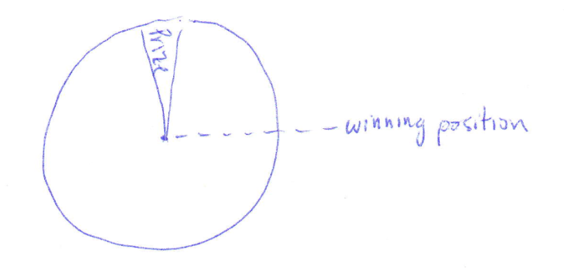

# {{ params.vars.title }}
I want to win a game of Wheel-of-Fortune.
The grand prize is initially located at a position at the top of the wheel (shown) and I only win if the wheel stops when the prize is at the position to the right ($\theta$ = 0).I note that when another contestant set the wheel spinning at $w_i = {\pi \over {{params.w_int}}} {rad\over s}$, it takes {{params.t}} seconds to stop.
## Part 1

With which initial velocity should I spin the wheel to win the prize?

### Answer Section

- {{ params.part1.ans1.value }} {{ params.vars.units}}
- {{ params.part1.ans2.value }} {{ params.vars.units}}
- {{ params.part1.ans3.value }} {{ params.vars.units}}
- {{ params.part1.ans4.value }} {{ params.vars.units}}

## Attribution

Problem is licensed under the [CC-BY-NC-SA 4.0 license](https://creativecommons.org/licenses/by-nc-sa/4.0/).  