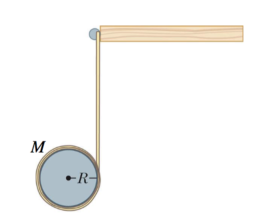

# {{ params_vars_title }}

## Question Text

A length of massless thread is wound around a solid spool of mass $M$ and radius $R$.
The end of the thread is attached to a horizontal bar as shown in the figure.
If the solid spool of thread is dropped from rest and falls without slipping, its acceleration will be:

Hint: You will need to look up the moment of inertia for the solid spool of thread. You should assume it is a "solid disk or cylinder about a cylinder axis".

### Answer Section

- {{ params_part1_ans1_value }}
- {{ params_part1_ans2_value }}
- {{ params_part1_ans3_value }}
- {{ params_part1_ans4_value }}
- {{ params_part1_ans5_value }}

## Attribution

Problem is licensed under the [CC-BY-NC-SA 4.0 license](https://creativecommons.org/licenses/by-nc-sa/4.0/).  