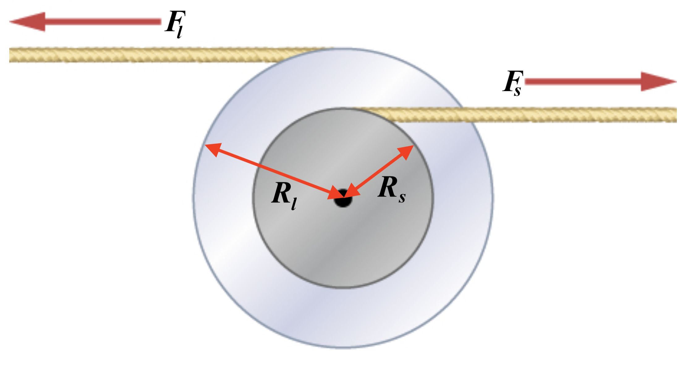

# {{ params_vars_title }}
Two flywheels of negligible mass and different radii are bonded together and rotate about a common axis (see below).

## Part 1

The smaller flywheel of radius $R_s = {{ params_Rs }} \rm{cm}$ has a cord that has a pulling force of $F_s = {{ params_Fs }} \rm{N}$ on it. What pulling force $F_l$ needs to be applied to the cord connecting the larger flywheel of radius $R_l = {{ params_Rl }} \rm{cm}$ such that the combination does not rotate?

### Answer Section

Please enter a numeric value in $\rm{N}$.

## Attribution

Problem is from the [OpenStax University Physics Volume 1](https://openstax.org/details/books/university-physics-volume-1) textbook, licensed under the [CC-BY 4.0 license](https://creativecommons.org/licenses/by/4.0/). 