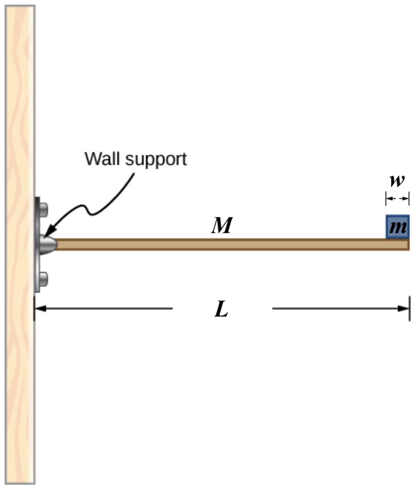

# {{ params_vars_title }}
A horizontal beam of length $L = {{ params_L }}$ $\rm{m}$ and mass $M = {{ params_M }}$ $\rm{kg}$ has a mass $m = {{ params_m }}$ $\rm{kg}$ and width $w = {{ params_w }}$ $\rm{m}$ sitting at the end of the beam (see the following figure).

## Part 1

What is the torque $\tau$ of the system about the support at the wall?

### Answer Section

Please enter a numerical value in $\rm{N \cdot m}$.

## Attribution

Problem is from the [OpenStax University Physics Volume 1](https://openstax.org/details/books/university-physics-volume-1) textbook, licensed under the [CC-BY 4.0 license](https://creativecommons.org/licenses/by/4.0/). 