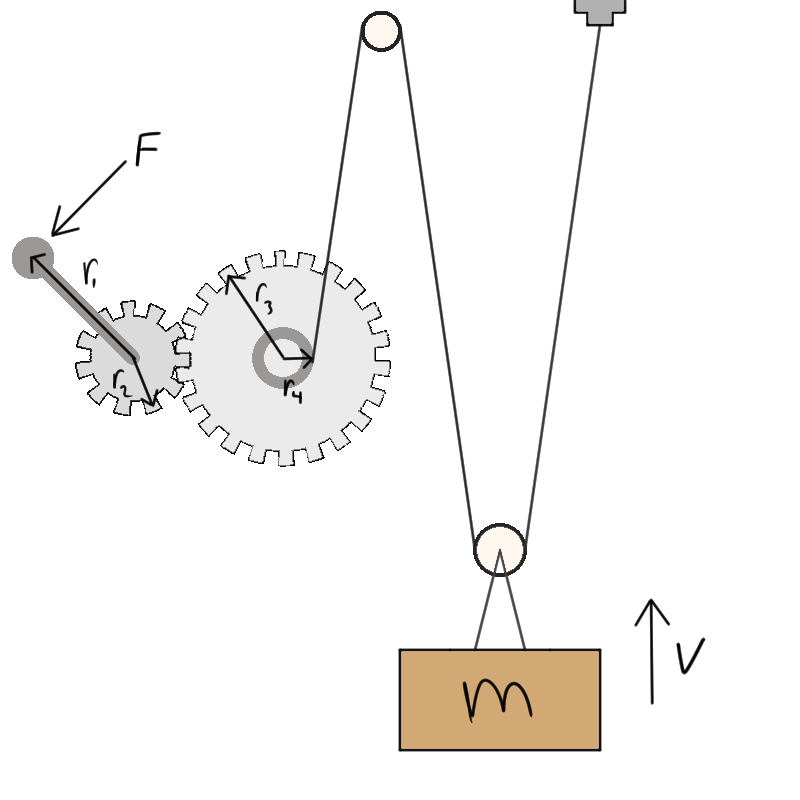

# {{ params_vars_title }}

## Question Text

The machine illustrated below lifts a mass $m$ by turning a pedal.
The pedal rotates a gear system, which pulls a rope along a pulley system that lifts the mass.
Select all modifications to the system that {{ params_choice }} the amount of force required to lift the object.

### Answer Section

Select all the choices that apply.

Note: You will be awarded full marks only if you select all the correct choices, and none of the incorrect choices. Choosing incorrect choices as well as not choosing correct choices will result in deductions.

- {{ params_part1_ans1_value}}
- {{ params_part1_ans2_value}}
- {{ params_part1_ans3_value}}
- {{ params_part1_ans4_value}}
- {{ params_part1_ans5_value}}

## Attribution

Problem is licensed under the [CC-BY-NC-SA 4.0 license](https://creativecommons.org/licenses/by-nc-sa/4.0/).  