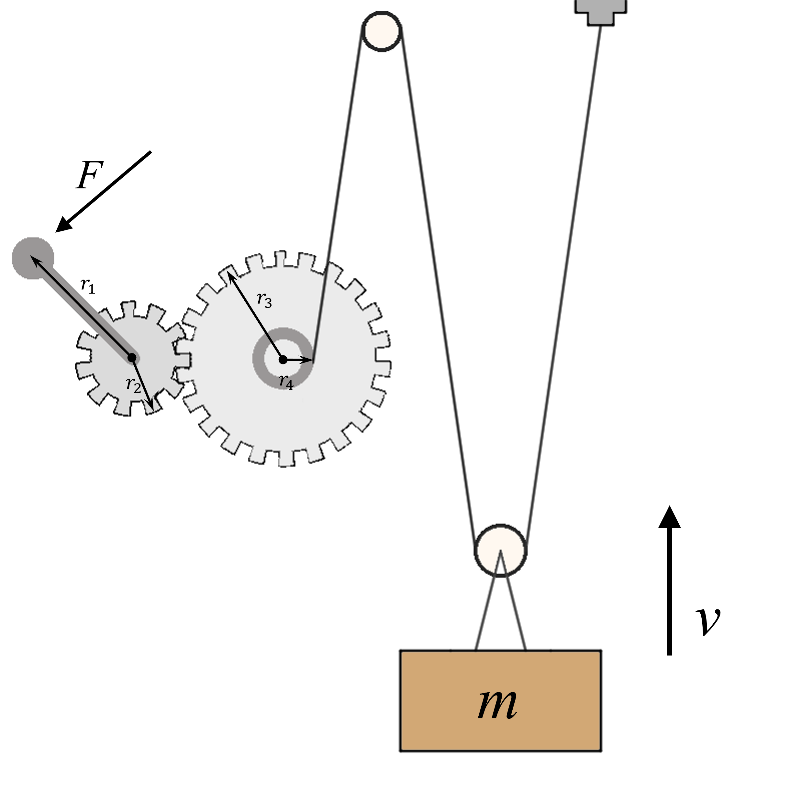

# {{ params_vars_title }}
The machine illustrated below lifts a mass m by turning a pedal with radius ${{params_r1}} \ \rm{m}$.
The pedal rotates a gear system, which pulls a rope along a pulley system that is lifting a mass of ${{params_m}} \ \rm{kg}$.
$r_2 = {{params_r2}} \ \rm{m}$  $r_3 = {{params_r3}} \ \rm{m}$  $r_4 = {{params_r4}} \ \rm{m}$.

## Part 1

If the pedal is rotated at ${{params_thetaDot}} \ \rm{rad/s}$, how fast is the mass rising?

### Answer Section

Please enter in a numeric value in m/s.

## Part 2

Find the minimum force required to lift the mass at a constant velocity.

### Answer Section

Please enter in a numeric value in N.

## Attribution

Problem is licensed under the [CC-BY-NC-SA 4.0 license](https://creativecommons.org/licenses/by-nc-sa/4.0/).  