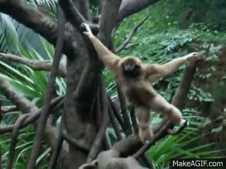

# {{ params_vars_title }}

(https://makeagif.com/gif/gibbon-brachiation-a5VJFW) sourced from this original YouTube video (https://www.youtube.com/watch?v=acy--k7Qww0)

Brachiation is a form of locomotion (movement) where primates swing from tree limb to tree limb using only their arms. During brachiation, the body is alternately supported under each forelimb.
Source: https://en.wikipedia.org/wiki/Brachiation

## Part 1

In brachiation, monkeys move from tree branch to tree branch by swinging from their arms. In the position shown in the figure (left), draw a free body diagram on the provided axes in the figure (right) for the monkey, assuming that it is momentarily at rest. (Label the forces $\vec{F}$ and $\vec{W}$ with subscripts on each, and include the angle).

Let the mass of the monkey be 10 kg, $\theta$ = 30 $^{\circ}$ , and the centre of mass of the monkey to be 50 cm from its centre of mass as shown in the figure.

### Answer Section

File upload box will be shown here.

## Part 2

Calculate the torque exerted by $\vec{F\_{m\ on\ b}}$ about the branch.

### Answer Section

Please enter in a numeric value in m.

## Part 3

Calculate the torque exerted by the mass of the monkey about the branch.

### Answer Section

Please enter in a numeric value in m.

## Part 4

The moment of inertia of a solid sphere about its centre is $\frac{2}{5}$ $M$$R^{2}$ . If the the mass of the monkey can be treated as a sphere of radius 30 cm. Find the moment of inertia of the monkey about its centre.

### Answer Section

Please enter in a numeric value in m.

## Part 5

The parallel axis theorem states that moment of inertia of an object of mass $m$ about an axis, a distance $d$ from its centre of mass is given by $I$ = $I\_{cm}$ + $m$$d^{2}$ . Find the moment of inertia of the spherical monkey about the branch.

### Answer Section

Please enter in a numeric value in m.

## Part 6

Find the angular acceleration of the monkey.

### Answer Section

Please enter in a numeric value in m.

## Part 7

Find the tangential acceleration of the centre of mass of the monkey about the branch.

### Answer Section

Please enter in a numeric value in m.

## Part 8

Your result from part 7 is not the same as you would get from solving for the acceleration from the free body diagram in part 1. Explain why this is, referring to the particle model.

### Answer Section

Answer in 2-3 sentences, try and use full sentences.

## Attribution

Problem is licensed under the [CC-BY-NC-SA 4.0 license](https://creativecommons.org/licenses/by-nc-sa/4.0/).  