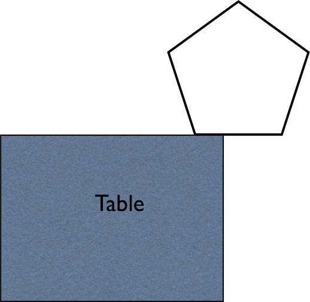

# {{ params_vars_title }}
The diagram in the figure below is showing a pentagon (with its mass uniformly distributed) close to the edge of a table.

## Part 1

The gravitational torque is :

### Answer Section

- {{ params_part1_ans1_value}}
- {{ params_part1_ans2_value}}

## Part 2

The sign of the gravitational torque is :

### Answer Section

- {{ params_part2_ans1_value}}
- {{ params_part2_ans2_value}}
- {{ params_part2_ans3_value}}

## Attribution

Problem is licensed under the [CC-BY-NC-SA 4.0 license](https://creativecommons.org/licenses/by-nc-sa/4.0/).  