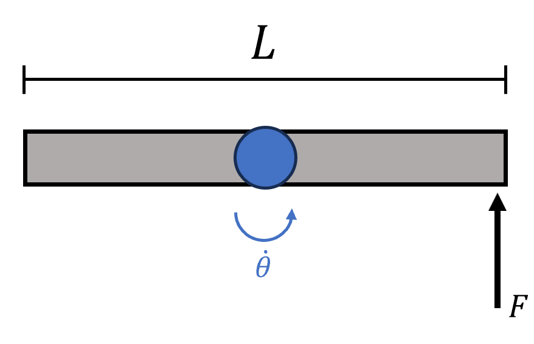

# {{ params_vars_title }}
A person is trying to spin a ${{params_m}} \ \rm{kg}$ stick around its center.
The stick is initially at rest and has a length $L={{params_L}} \ \rm{m}$.
He applies a force $F={{params_F}} \ \rm{N}$ at one end of the stick.

## Part 1

How long does it take for the stick to spin at $\dot \theta={{params_thetaDot}} \ \rm{rad/s}$?

### Answer Section

Please enter in a numeric value in s.

## Attribution

Problem is licensed under the [CC-BY-NC-SA 4.0 license](https://creativecommons.org/licenses/by-nc-sa/4.0/).  