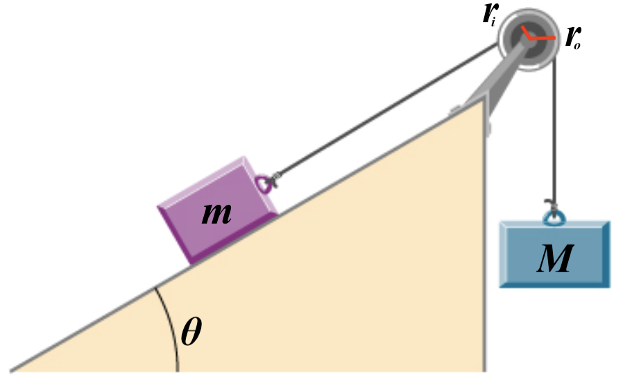

# {{ params_vars_title }}
A mass on a frictionless inclined plane $m = {{ params_m }} \rm{kg}$ is connected to a pulley by a massless string at an inner radius $r_i = {{params_ri}} \rm{cm}$. Another mass $M$ is hanging from the pulley by a massless string connected at an outer radius $r_o = {{ params_ro }} \rm{cm}$. The inclined plane makes an angle $\theta = {{ prams.theta }}^\circ$ with the horizontal.

## Part 1

What must the hanging mass $M$ be to keep the pulley from rotating?

### Answer Section

Please enter a numeric value in $\rm{kg}$.

## Attribution

Problem is from the [OpenStax University Physics Volume 1](https://openstax.org/details/books/university-physics-volume-1) textbook, licensed under the [CC-BY 4.0 license](https://creativecommons.org/licenses/by/4.0/). 