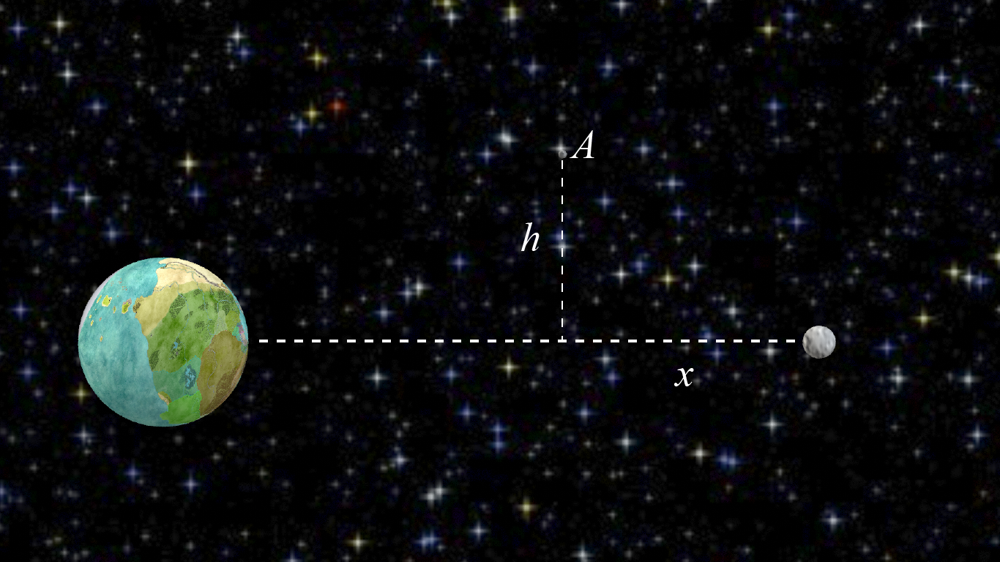

# {{ params.vars.title }}

## Question Text

An asteroid is floating through space on a collision course for earth. Determine the distance h for which the asteroid A will experience equal attraction from Earth and
the moon on its journey.
The distance between the Earth and moon centres is 384398 $km$.
The moon has 0.0123 times the mass of the Earth.
x = {{params.x}}{{params.vars.units}}

### Answer Section

Please enter in a numeric value in {{ params.vars.units }}.

## Attribution

Problem is licensed under the [CC-BY-NC-SA 4.0 license](https://creativecommons.org/licenses/by-nc-sa/4.0/).  