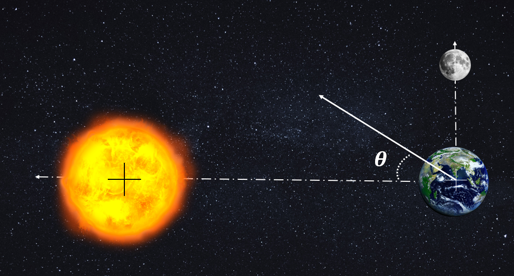

# {{ params_vars_title }}

The height of the ocean tides periodically vary according to the time of day due to the orbital motion of the Earth around the Moon coupled with that of the Earth around the Sun, and the changing gravitational forces acting on the Earth.

$G = 6.67 \times 10^{-11}, M\_{earth} = 5.976 \times 10^{24} \ \rm{kg}, M\_{sun} = 333000 M\_{earth}, M\_{moon} = 0.0123 M\_{earth}$
$D\_{MoonEarth} = {{ params_Dme }} \ \rm{km}, D\_{SunEarth} = {{ params_Dse }} \times 10^6 \ \rm{km}$

## Part 1

In the relative configuration given below, determine the magnitude of the resultant gravitational force acting on the Earth.

### Answer Section

Please enter in a numeric value in {{ params_vars_units }}.

## Part 2

In the relative configuration given below, determine the direction of the resultant gravitational force acting on the Earth.

### Answer Section

Please enter in a numeric value in {{ params_vars_units }}.

## Part 3

If the depth of the tides are measured normal to the Earth's surface with the surface of the Earth being that of zero displacement, at what point along the orbit of the Moon around the Earth causes the highest tides?

### Answer Section

Choose the best answer.

- {{ params.part2.ans1.value }}
- {{ params.part2.ans2.value }}
- {{ params.part2.ans3.value }}

## Attribution

Problem is licensed under the [CC-BY-NC-SA 4.0 license](https://creativecommons.org/licenses/by-nc-sa/4.0/).  