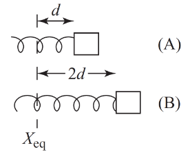

# {{ params.vars.title }}
Two identical springs are attached to two identical masses.
Both masses are free to slide along a frictionless horizontal surface.
One of the springs is displaced a distance {{ params.d1 }} from its equilibrium position, while the other is displaced a distance {{ params.d2 }}.

## Part 1

If both masses are released at the same instant, which of the springs, A or B, returns to its unstretched length first?

### Answer Section

- {{ params.part1.ans1.value }}
- {{ params.part1.ans2.value }}
- {{ params.part1.ans3.value }}
- {{ params.part1.ans4.value }}

## Attribution

Problem is licensed under the [CC-BY-NC-SA 4.0 license](https://creativecommons.org/licenses/by-nc-sa/4.0/).  