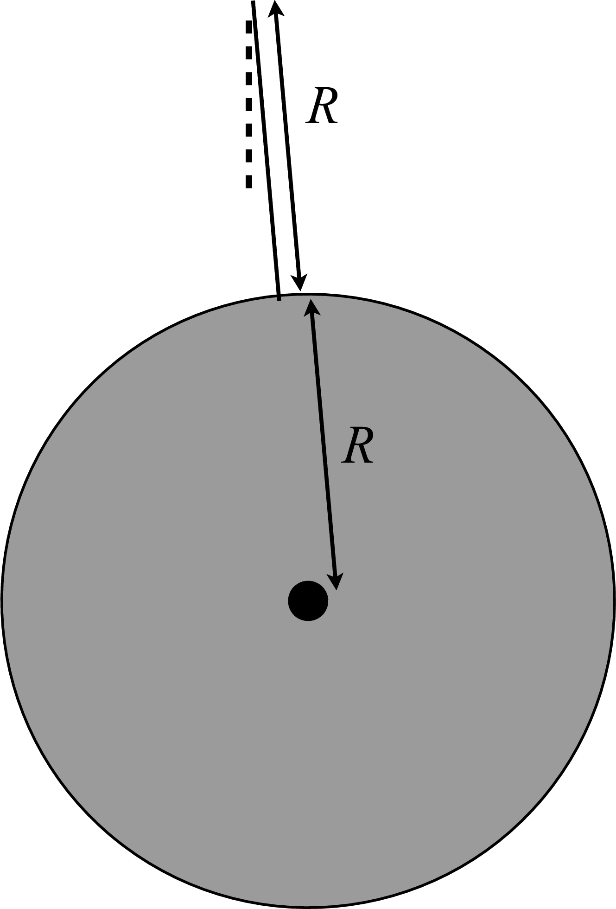

# {{ params_vars_title }}
A solid disk of mass $M$ and radius $R$ is swung from a massless string of length $R$ through a small angle as shown in Figure; Let $R$={{ params_R }}r.

<!-- Button trigger modal -->

<button type="button" class="btn btn-primary" data-toggle="modal" data-target="#exampleModalLong">
  Hint
</button>

<!-- Modal -->

  

        

          

            <h5 class="modal-title" id="exampleModalLongTitle">Hint</h5>
            <button type="button" class="close" data-dismiss="modal" aria-label="Close">
              &times;
            </button>
          

          

          The moment of inertia about the center of a solid disk is given by \(I_{\text{cm}} = \frac{1}{2} MR^2\), and the moment of inertia about a parallel axis a distance \(l\) away from the center of an object is given by \(I = Ml^2 + I_{\text{cm}}\).
          

          

            <button type="button" class="btn btn-secondary" data-dismiss="modal">Close</button>
          

    

  

## Part 1

Find the {{ params_pendulum }}

Note that it may not be necessary to use every variable. Use the following table as a reference for each variable:

| For  | Use|
|----- |----|
| $M$  | M  |
| $r$  | r  |
| $g$  | g  |

### Answer Section

### pl-submission-panel

### pl-answer-panel

## Attribution

Problem is licensed under the [CC-BY-NC-SA 4.0 license](https://creativecommons.org/licenses/by-nc-sa/4.0/).  